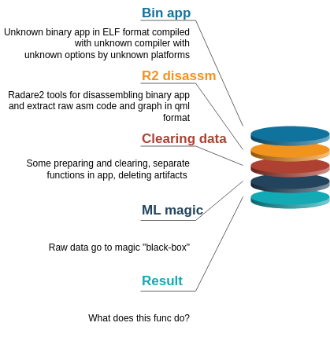

# WhatDoesThisFuncDo

This is another attempt to push ML wherever you can :)

This project is designed for learning aims to explore func's behavior with ML using only their low-level code.

Its purpose: to answer  **what does this func do?**

# Observe the repo

The repo consist of several part: data and data preparation instruments, data visualisation, some standard ML algorithms implementatin and DL algorithmsa, trained on existed data neuralnetwork (prepared to use).

You can use the already existed data or add new and train then you own network.

All models in pickle format and score results [here](./models_pickle). Presentations [here](./tools/pdf).

In the future, I plan get also data from this [list of open source C++ libraries](https://en.cppreference.com/w/cpp/links/libs)

# Func's classes

I use that classes of funcs (no best choose, I know):

* String and text processing
* Networking
* Containers
* Algorithms
* Programming
* Math and numerics
* Data structures
* System

# Steps

* data preparation: go [there](./tools/raw_data_prepare/)
* data visualization: go [there](./tools/data_visualisation/)
* standart (linear) Ml algorithms: go [there](./tools/linear_models/)
* advanced (no only linear) ML algorithms: go [there](./tools/no_only_linear_models/)
* DL : *soon*
* conclusion: *not soon*
* completed models and their score: go [there](./models_pickle)

## Data preparation:
* get or add the data for training: go [there](./tools/raw_data_prepare/)

| Number | Library     | Source                          |
|--------|-------------|---------------------------------|
| 1      | `boost`      | [boost](https://www.boost.org/) |
| 2      | `STL`       | ...                             |
| 3      | `Asio`  | ...                             |
| 4      | `Silicon` | ...                             |

#### Boost (with std=c++14)
- [x] gcc 10.2.1 O0
- [x] gcc 10.2.1 O1
- [x] gcc 10.2.1 O2
- [x] gcc 10.2.1 O3
- [x] gcc 10.2.1 Os
- [x] gcc 10.2.1 Og
- [x] gcc 10.2.1 Ofast
- [x] gcc 9.3.0 O0
- [x] gcc 9.3.0 O1
- [x] gcc 9.3.0 O2
- [x] gcc 9.3.0 O3
- [x] gcc 9.3.0 Os
- [x] gcc 9.3.0 Og
- [x] gcc 9.3.0 Ofast
- [ ] gcc 8 O1
- [ ] gcc 8 O2
- [ ] gcc 8 O3
- [ ] gcc 8 Os
- [ ] gcc 8 Oz
- [ ] gcc 7 O0
- [ ] gcc 7 O1
- [ ] gcc 7 O2
- [ ] gcc 7 O3
- [ ] gcc 7 Os
- [ ] gcc 7 Oz
- [ ] gcc 6 O0
- [ ] gcc 6 O1
- [ ] gcc 6 O2
- [ ] gcc 6 O3
- [ ] gcc 6 Os
- [ ] gcc 6 Oz

....

- [ ] clang
- [ ] icc
- [ ] gcc-mingw
- [ ] Cygwin

## Results

# Literature

[arXiv:1903.11397v3 [cs.PL] 7 Jul 2020: Lost in translation: Exposing hidden compiler optimization opportunities](https://arxiv.org/pdf/1903.11397.pdf)
