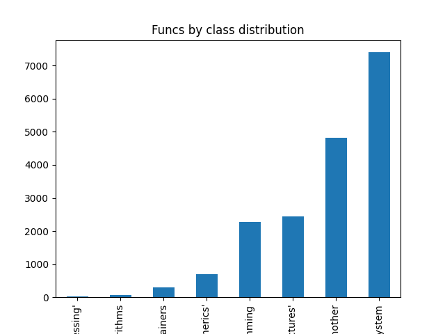
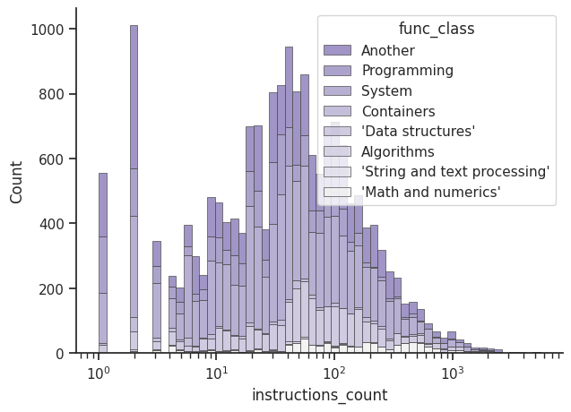
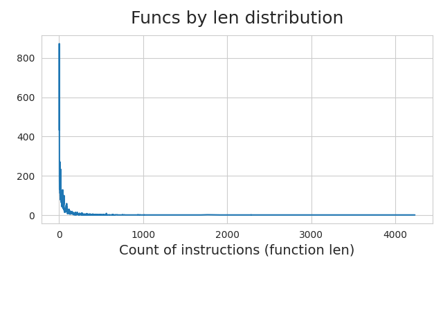
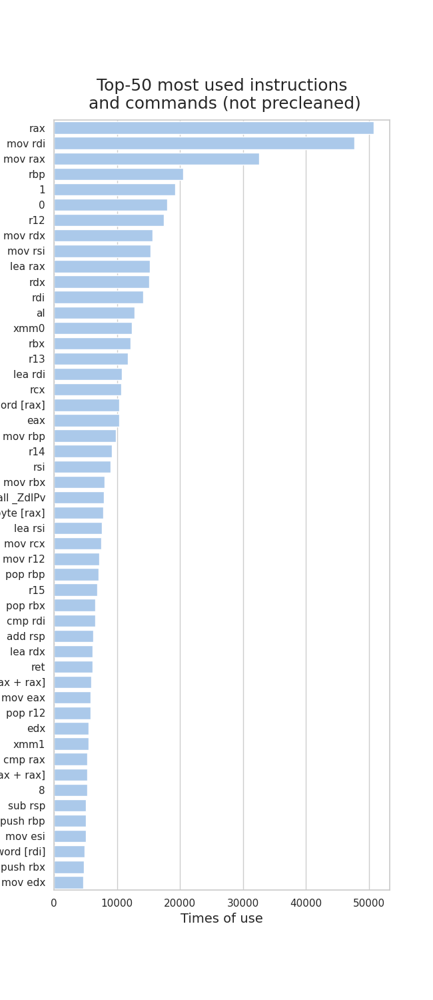
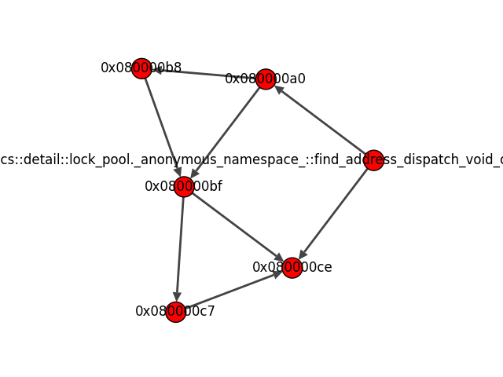

# Explore the data

By this date I'm been in time prepare data from one library by two compilers version with 6 options each. *Other work I do later*.

All functions count (with dublicates) consist of **142438** position. But as I saw later, the compilation options did not affect the variability of the code (maybe I was doing something wrong). There are only **18047** unique positions left. 

Some data details present forward:

## ToDo

- [x] more beautiful plots (seaborn)
- [x] more informative plots
- [x] correct some visualisation wrongs
- [x] visualise the graph