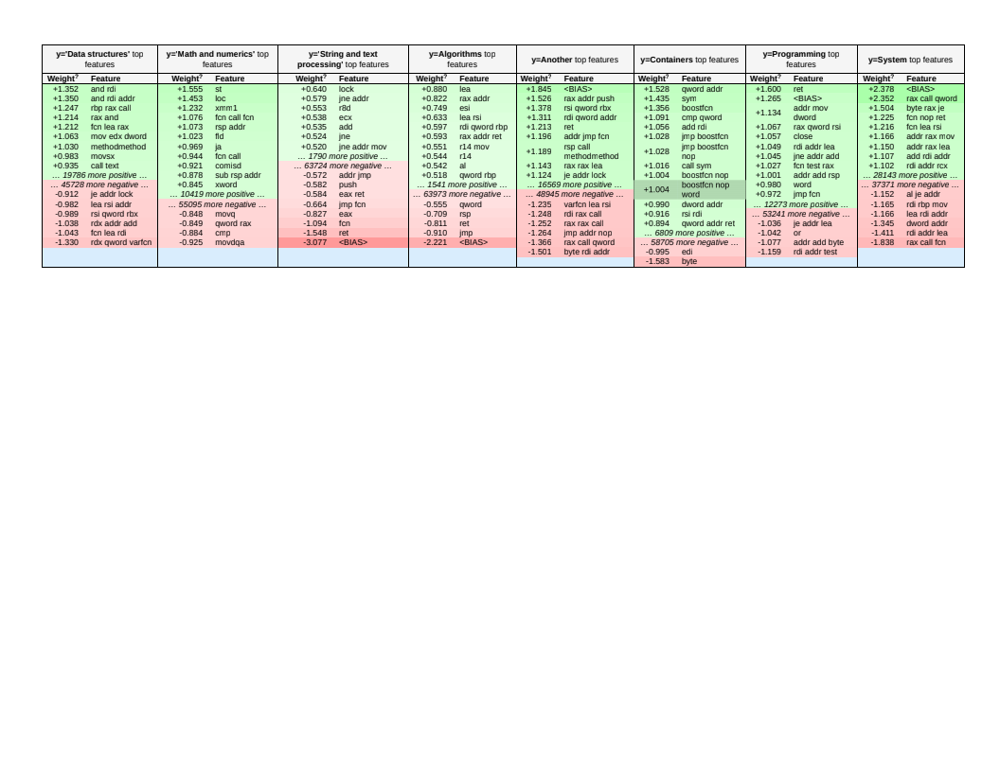

# Linear model experiments

- In file  `EDA_train_test_split`  some EDA and data split to `train` and `test` (they copied [here](../../data/for_linear_models/))
- Input shape `142438` rows
- Main problems: mangled names, address as instructions, technical names
- After clearing shape `10213` unique functions body
- Extracting graph characteristics by `igraph` (example in `graph_worker.py`)
- data with graph structure also [here](../../data/for_linear_models/) with postfix `_feature`
- in file `linear_model` presented results of experiments with only LINEAR models
- all resulst with graphics you can see in this [presentation](../pdf/)

# Data explaining

- many `AND` in `Data structures`
- used `XMM` in `Math and numbers`
- many `JNE` in `String and text`
- used `R14` in `Algorithms`
- many `ADDR` in `System`

... or it only seem..

# TODO (think about):
- how use information about address for best score
- how use more data from graph structure
- separate operands and operators
- classes disbalansed
- how get more data...and more...and more :)